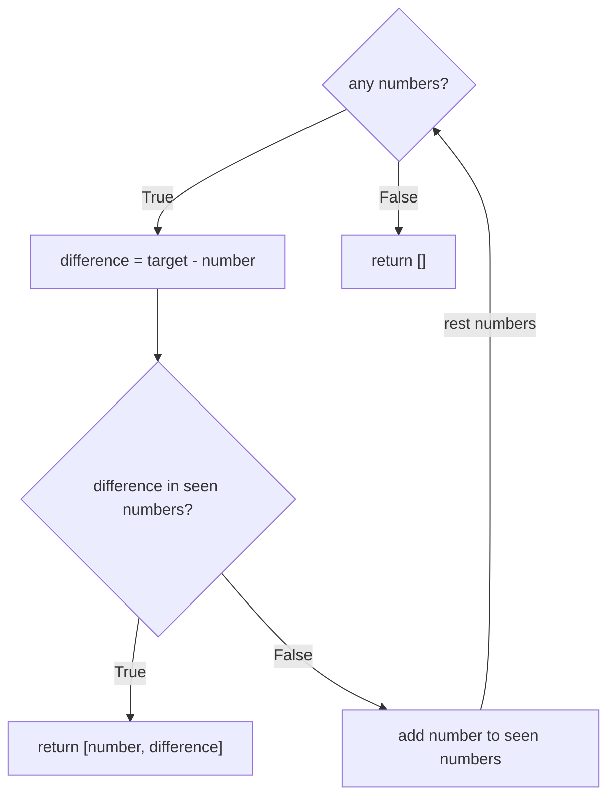

# Two Number Sum

Find two numbers in `numbers` which sum equals `target`

- function
  - arguments
    - numbers [int]
    - target: int
  - return
    - Success: [n1, n2] or [n2, n1]
    - Fail: []
- constraints
  - Can't use the same numbers twice
    - numbers [1, 5] target 2
    - 1 can not be used twice 

Example

```python
numbers = [3, 5, -4, 8, 11, 1, -1, 6]
target = 10

# f(numbers, target) => [-1, 11]
# As -1 + 11 = 10 (target)
```

## Solution 1 - Brute force

Try all the permutations


### Solution 1 - Passed

| Category | Value | Reason                    |
| -------- | ----- | ------------------------- |
| Space    | O(n)  | Running through same loop |
| Time     | O(n)  | For loop                  |

## Solution 2 - Record every difference

- Step through each number
- Get the difference from the target
- if we have seen the difference
  - return difference and current number
  - otherwise record difference and continue



### Solution 2 - Passed


| Category | Value | Reason                    |
| -------- | ----- | ------------------------- |
| Space    | O(n)  | Running through same loop |
| Time     | O(n)  | For loop                  |
