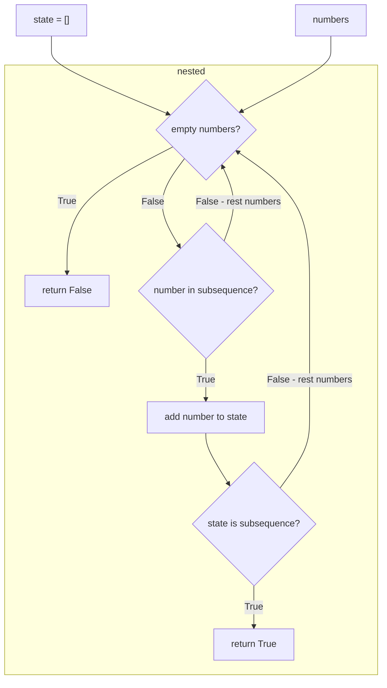

# Validate Subsequence

Is `sub` a subsequence of `numbers`

subsequence = set numbers that are in the same order of another. (Don't have to be adjacent)

- function
  - arguments
    - numbers [int]
    - subsequence: [int]
  - return
    - bool
  - constraints
    - numbers and subsequence will never be empty

Example

```python
numbers = [1, 2, 3, 4, 5]
subsequence = [1, 3]

# f(coll, subsequence) => true
# [1, _, 3, _, _]

```

