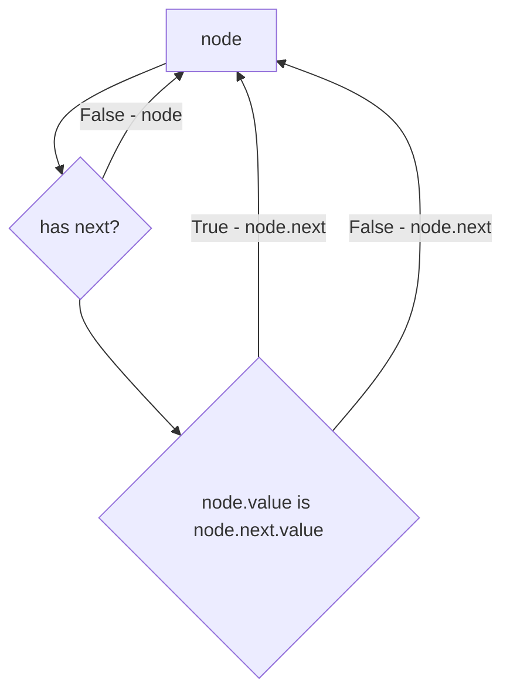

# Remove duplicates from linked list

```mermaid
flowchart TD
node --> hasNext{"has next?"}
hasNext --> |False - node|node
hasNext --> equals{"node.value is node.next.value"}
equals --> |"True - node.next"| node
equals --> |"False -  node.next"| node
```
