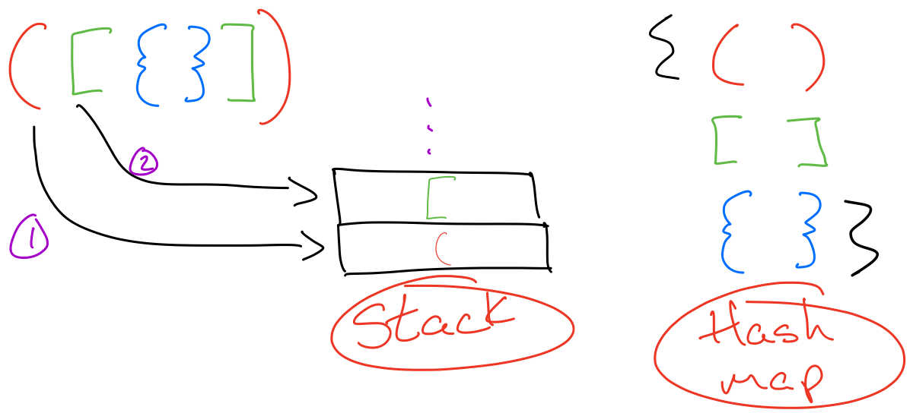

= 20 Valid Parentheses
Given a string s containing just the characters '(', ')', '{', '}', '[' and ']', determine if the input string is valid.

An input string is valid if:

. Open brackets must be closed by the same type of brackets.
. Open brackets must be closed in the correct order.

== Constraints
s consists of parentheses only '()[]{}'.

== Solutions

=== Solution 1 - Stack

Use a stack to store parentheses.

.Pseudo code
[source, python]
----
parentheses = {( )
               [ ]
               { }}

open-parentheses = (set (keys parentheses))
closed-parentheses = (set (values parentheses))

function pair?(x y)
  (get parentheses x) = y

function stack x & xs
  (x = null) true
  (contains? open-parentheses x) (recur (push x to stack) xs) 
  (contains? close-parentheses x) (if (pair? (peek stack) x)
                                    (recur (pop stack) xs)
                                    false
  else false

----

