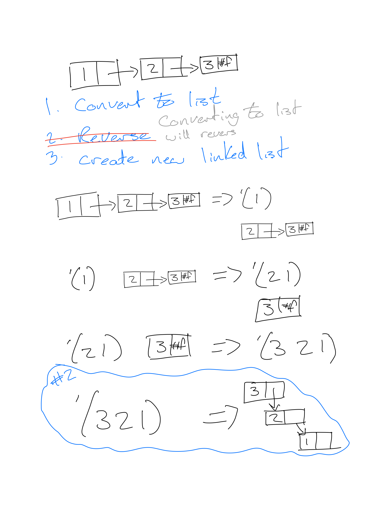

= Reverse Linked List
Given the head of a singly linked list, reverse the list, and return the reversed list.

== Constraints
* The number of nodes in the list is the range [0, 5000]
* -5000 <= Node.val <= 5000

== Examples
```
Input: head = [1,2,3,4,5]
Output: [5,4,3,2,1]

Input: head = [1,2]
Output: [2,1]

Input: head = []
Output: []
```

== Solutions

=== Solution 1


==== Solution 1 - Passed!

|===
| | Runtime | Memory
| Mine | 200ms | 100.8mb 
| Others | 100% faster | 100% less
|===