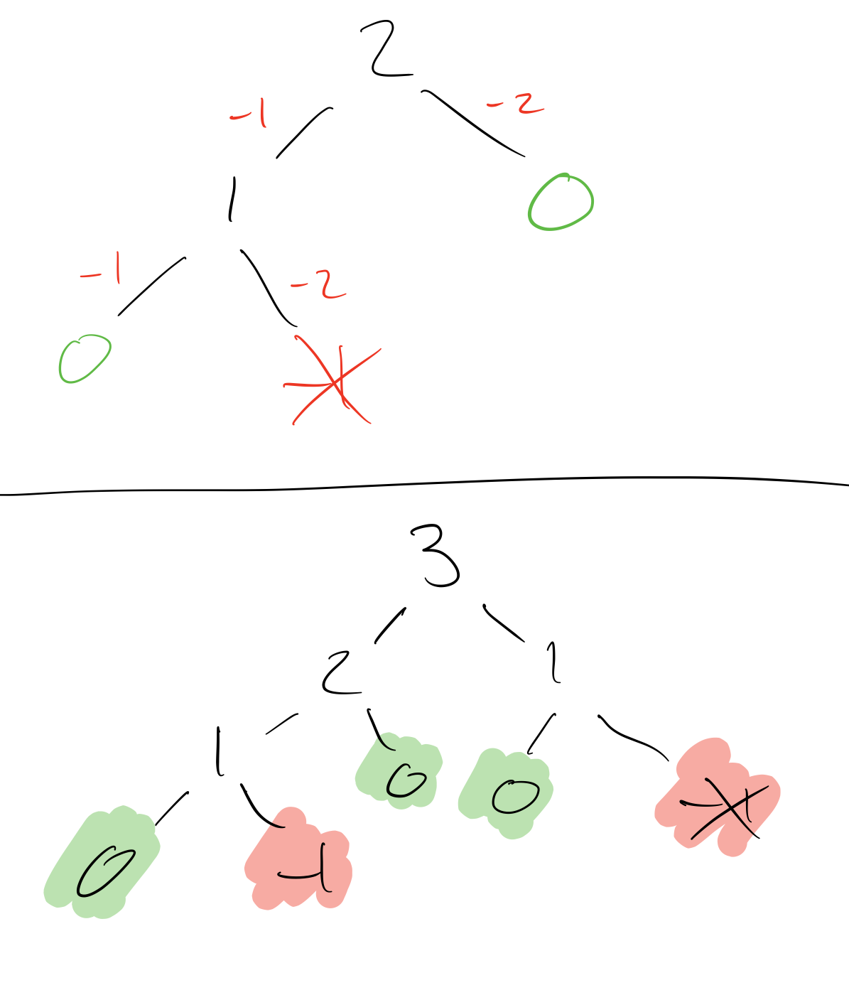
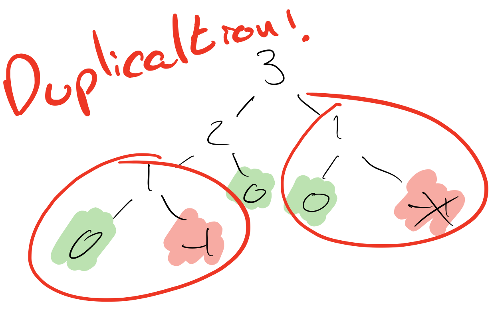

= Climbing stairs

You are climbing a staircase. It takes n steps to reach the top.
Each time you can either climb 1 or 2 steps. In how many distinct ways can you climb to the top

== Constraints
* List length (n) 1 to 45

== Examples
[source]
----
Input: n = 2
Output: 2

. 1 step + 1 step
. 2 steps
----

[source]
----
Input: n = 3
Output: 3

. 1 step + 1 step + 1 step
. 1 step + 2 steps
. 2 steps + 1 step
----

== Solutions

=== Solution 1 - Recursive tree

==== Failed (Time Limit Exceeded) 
Timing the failing test case from Leetcode (input: 44) takes 24 seconds. What can we do to improve. 

.Time recursive tree
[source, racket]
----
recursive-tree.rkt> (climb-stairs 44) 
cpu time: 23773 real time: 24090 gc time: 38
1134903170
----

The first thing that stands out is duplication. On a larger input such as `44` the `1` and `2` use case will be generated many times. Let's remove it.

=== Solution 2 - Recursive tree without duplication

So we know the 1 use case returns 1 and the 2 use case returns 2. Lets add those use cases.

[source, racket]
----
(cond
  [(= n 2) 2]
  [(= n 1) 1]
  ...)
----

=== Refactor - Remove cases
As we are now handling the `1` and `2` use cases we don't need to check for `0` or `less than 0` so lets also remove them. 

[source, racket]
----
(cond
+  [(= n 2) 2]
+  [(= n 1) 1]
-  [(zero? n) 1]
-  [(< n 0) 0]
  ...)
----

And now we are only checking for specific cases we can use pattern matching.

[source, racket]
----
(define/match (climb-stairs n)
    [(1) 1]
    [(2) 2]
    [(n) (+
           (climb-stairs (- n 2))
           (climb-stairs (- n 1)))])
----

.Time recursive tree handling base cases
[source, racket]
----
recursive-tree.rkt> 
cpu time: 10555 real time: 10687 gc time: 0
1134903170
recursive-tree.rkt
----

Optimised version now only takes 13 seconds lets try that.

=== Failed (Time Limit Exceeded)

Time limit exceed again! We got some really good performance gains from avoiding duplication at the very base of the tree so I think we should continue with this line of thinking for now. If we avoid duplication even further up the tree we should get similar performance gains. Let's record even more values except this time the function will build up the records instead adding extra cases to our `cond`

=== Solution 3 - Recursive tree without actual duplication